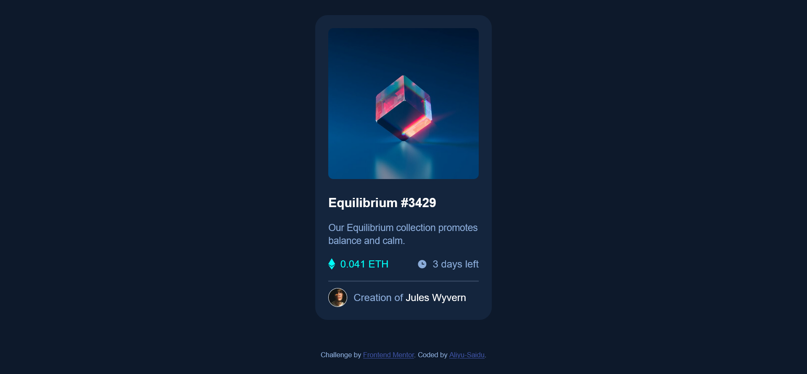

# Frontend Mentor - NFT preview card component solution

This is a solution to the [NFT preview card component challenge on Frontend Mentor](https://www.frontendmentor.io/challenges/nft-preview-card-component-SbdUL_w0U). Frontend Mentor challenges help you improve your coding skills by building realistic projects. 

## Table of contents

- [Overview](#overview)
  - [The challenge](#the-challenge)
  - [Screenshot](#screenshot)
  - [Links](#links)
- [My process](#my-process)
  - [Built with](#built-with)
  - [What I learned](#what-i-learned)
  - [Continued development](#continued-development)
  - [Useful resources](#useful-resources)
- [Author](#author)
- [Acknowledgments](#acknowledgments)

**Note: Delete this note and update the table of contents based on what sections you keep.**

## Overview

### The challenge

This is a solution to a NFT preview card component challenge from frontendmentor.io. In this solution, while Vanilla CSS Grid was used to place the whole component at the center of the web page in both mobile and desktop view. Vanilla CSS Flexbox was used for horizontal alignments of the internal sections.

### Screenshot

### Links

- Solution URL: [Add solution URL here](https://your-solution-url.com)
- Live Site URL: [Add live site URL here](https://your-live-site-url.com)

## My process

### Built with

- Semantic HTML5 markup
- CSS custom properties
- Vanilla CSS Flexbox
- Vanilla CSS Grid
- Mobile-first workflow

### What I learned

- Project Planning!
- Writing a README file for my project!
- The use of Git basic commands to create a Repo in Gitup for this solution!
- Practicing Vanilla CSS flex and grid layout skills!
- The use of background image to replace an image tag for decoration purpose!
- Creating hover effect.

### Continued development

- Semantic HTML and Creating More Accessibility Compliant Websites
- Positioning, Vanilla CSS grid and flexbox layouts
- Focus more on Learning UI & UX (very important!)
- Docummentation 

### Useful resources

-frontendmentor.io for practicing coding skills and learning git and github basic commands.
- CSS Flex  Grid Complete Guide with Real World Examples and Code Snippets (Vanilla CSS) by Shruti Balasa, first edition, for the basic vanilla css flexbox and css grid layouts.

## Author

- Website - [in progress]
- Frontend Mentor - [@Aliyu-Saidu](https://www.frontendmentor.io/profile/Aliyu-Saidu)
- Twitter - [will add one when I am set](https://www.twitter.com/@koddinglab)

